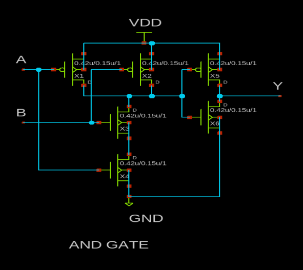

# Standard-Cell-Design

Custom standard cells are designed for the Skywater130nm node

##Standard Cells
1.And2_1x
2.And3_1x
3.And4_1x
4.And2_2x
5.And3_2x
6.And4_2x
7.a2111oi
8.a311oi
9.a31oi
10.a32oi

##What is Non Linear Delay Model(NLDM)?
NLDM is derived from SPICE characterizations and is a highly reliable timing model. The table model is referred to as an NLDM and is used to measure the delay, performance slew, or other timing checks. Most of the cell libraries used table models to specify the delay and timing checks for different cell timing arcs.

For different combinations of input at the cell input pin and multiple output capacitance at the cell output pin, the table provides the delay through the cell. In a two-dimensional array, where the two independent variables are the input transition and the capacitance of the output load and the entries in the table are the delays. The characterization is performed using the ngspice open source circuit simulator.

##Cell Rise Time, Fall Time, Rise Transition and Fall Transition

The time taken by a signal to increase from 20 percent to 80 percent of its maximum value is known as "rise time". 
The time taken by a signal to increase from 80 percent to 20 percent of its maximum value is known as "fall time".

The time taken for a signal to propagate through a gate or net is the propagation delay. The time taken by a signal at the input pin to impact the output signal at the output pin is the propagation delay of a gate or cell. A delay of 50 percent of the input transition to the corresponding 50 percent of the output transition is calculated for any gate propagation.

Considering the rise/fall of both input and output, we are faced with four propagation delays:

50% of input rise to 50% of output rise.
50% of input rise to 50% of output fall.
50% of input fall to 50% of output rise.
50% of input fall to 50% of output fall.
All the delays will have different values, or in some cases same values.

##Schematic Diagram 
The following schematic are designed using Xschem.

## Pre Layout Simulation

The simulation is done using the Ngspice. Ngspice is a open source simulation and analysis tool.

To run spice simulation use `ngspice <filename>.spice`

